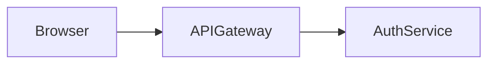

# excalidraw-mcp

MCP server that lets Claude Desktop draw on an Excalidraw canvas in real time, with diagram-as-code support via Kroki and an Obsidian-compatible vault for versionable diagram sources.

## Architecture

```
excalidraw-mcp/
├── docker-compose.yml        ← bridge + excalidraw-app + kroki + mermaid containers
├── scenes/                   ← .excalidraw files (shared Docker volume)
├── diagrams-vault/           ← Obsidian vault (separate git repo, mounted into bridge)
│   ├── .obsidian/
│   ├── Architecture/
│   ├── Flows/
│   ├── Sequences/
│   ├── Infrastructure/
│   └── README.md
├── bridge/                   ← Express + chokidar + SSE (port 3001, Docker only)
├── excalidraw-app/           ← React/Vite app → nginx (port 3000)
└── mcp-server/               ← TypeScript MCP server (runs locally, stdio)
```

**Live-reload flow (scenes):** Claude calls MCP tool → bridge HTTP API → writes `.excalidraw` file → chokidar fires → SSE push to browser → `excalidrawAPI.updateScene()` (no page refresh).

**Live-reload flow (diagrams):** Claude calls diagram MCP tool → writes `.md` to vault → Kroki renders SVG → SVG as base64 image element in Excalidraw → git auto-push → bridge SSE → browser reloads.

**Networking:** The excalidraw-app's nginx proxies `/api` → `bridge:3001` inside the Docker network. The MCP server runs on the host and talks to the bridge via `BRIDGE_URL` (default `http://localhost:3001`). The bridge port must be mapped to the host (`ports: ["3001:3001"]` in docker-compose.yml). Kroki is exposed on `localhost:8000` via `KROKI_URL`.

## Services

### bridge (`bridge/src/index.ts`)
- Express server on port 3001
- `SCENES_DIR` env var (default `./scenes`) — mount point for the shared volume
- Routes: `GET /health`, `GET /events` (SSE), `GET /scenes`, `GET /scenes/:name`, `PUT /scenes/:name`, `DELETE /scenes/:name`, `POST /scenes/:name/rename`
- Additional routes for diagrams: `GET /diagrams`, `GET /diagrams/:path`, `PUT /diagrams/:path`, `DELETE /diagrams/:path`
- chokidar also watches vault `.md` files — triggers Kroki re-render + SSE push on change
- `sanitizeName()` strips path traversal and enforces `.excalidraw` extension
- SSE heartbeat every 25s to keep connections alive through nginx

### kroki + mermaid (Docker services)
- Kroki on port 8000 (`yuzutech/kroki`) — renders Mermaid, PlantUML, Graphviz/DOT, D2, C4, Structurizr, BPMN, Erd, Nomnoml, and ~20 more formats to SVG
- Mermaid companion container (`yuzutech/kroki-mermaid`) required by Kroki for Mermaid support
- MCP server calls Kroki via `KROKI_URL` env var (default `http://localhost:8000`)

### excalidraw-app (`excalidraw-app/src/App.tsx`)
- React + `@excalidraw/excalidraw`, dark theme
- Toolbar: scene selector dropdown, New / Save / Delete buttons, SSE status dot (amber=connecting, green=live, red=reconnecting)
- SSE client auto-reconnects every 3s on error
- Ctrl+S / Cmd+S saves current scene back to bridge
- Nginx proxies `/api` → `bridge:3001` (see `nginx.conf`)

### mcp-server (`mcp-server/src/`)
- `index.ts` — MCP server (stdio transport), tool definitions and handlers
- `builder.ts` — `buildElements(specs)` → Excalidraw JSON elements + idMap
- `types.ts` — TypeScript types for Excalidraw elements and `ElementSpec`
- `BRIDGE_URL` env var (default `http://localhost:3001`)
- `KROKI_URL` env var (default `http://localhost:8000`)
- `VAULT_PATH` env var — absolute path to `diagrams-vault/` on the host
- Uses `simple-git` for auto-push after diagram create/update
- Package manager: **pnpm** (lock file present)
- Build: `tsc` → `dist/`, entry `dist/index.js`

## MCP Tools

### Scene tools

| Tool | Description |
|---|---|
| `list_scenes` | List all `.excalidraw` files |
| `create_scene` | Create empty scene (name, optional background hex) |
| `read_scene` | Return full scene JSON |
| `add_elements` | Add elements (rectangle/ellipse/diamond/line/arrow/text) |
| `update_element` | Patch element properties by ID |
| `delete_element` | Remove elements by ID array |
| `clear_scene` | Remove all elements |
| `delete_scene` | Delete the file permanently |
| `get_scene_summary` | Element counts, types, bounding box |
| `add_diagram` | **Power tool** — nodes + connections → full diagram in one call |

### Diagram-as-code tools (Kroki + vault)

| Tool | Description |
|---|---|
| `create_diagram` | Write `.md` to vault → Kroki renders → SVG image element in Excalidraw → git push |
| `update_diagram` | Edit diagram source → re-render in-place → git push |
| `render_diagram` | Re-render an existing diagram (e.g. after clearing a scene) |
| `get_diagram` | Read source code + description from vault |
| `list_diagrams` | Browse vault by folder |
| `git_log` | View diagram history |
| `git_status` | Check remote / branch config |

### Vault markdown format

Each diagram is a `.md` file with YAML frontmatter:

```markdown
---
title: System Architecture
format: mermaid
scene: architecture.excalidraw
tags: [architecture, backend]
created: 2025-01-15
updated: 2025-01-15
---

# System Architecture

> One-line description


```

`format` can be any Kroki-supported type: `mermaid`, `plantuml`, `graphviz`, `d2`, `c4plantuml`, `structurizr`, `bpmn`, `erd`, `nomnoml`, etc.

### `add_elements` spec fields
`type`, `x`, `y`, `width`, `height`, `text` (label shorthand for shapes), `strokeColor`, `backgroundColor`, `fillStyle`, `strokeWidth`, `strokeStyle`, `roughness` (0=clean/1=normal/2=sketchy), `opacity`, `rounded`, `fontSize`, `fontFamily` (1=Virgil hand/2=Helvetica/3=Cascadia mono), `textAlign`, `points` (for line/arrow), `startArrowhead`/`endArrowhead`, `startBindingId`/`endBindingId`

### `builder.ts` internals
- Shape with `text` → emits both the shape element and a bound `TextElement` (containerId set)
- Linear elements: bounding box computed from points; `startBindingId`/`endBindingId` → `{ elementId, focus: 0, gap: 8 }`
- IDs: `randomBytes(8).toString("hex")`; `seed`/`versionNonce`: random int < 2^31
- Default fillStyle is `hachure`; default roughness is `1`

## Dev Commands

```bash
# Docker services (now includes Kroki + Mermaid)
docker compose up --build -d
docker compose logs -f bridge

# MCP server (host machine)
cd mcp-server
pnpm install
pnpm run build          # tsc → dist/
pnpm run dev            # tsx (no build needed)

# First-time vault setup (interactive: inits git + sets GitHub remote)
bash setup-vault.sh
```

## Claude Desktop Config

**Docker (recommended)** — after `docker compose up -d`, no local Node.js needed:

```json
{
  "mcpServers": {
    "excalidraw": {
      "command": "docker",
      "args": ["exec", "-i", "excalidraw-mcp", "node", "/app/dist/index.js"]
    }
  }
}
```

**Host (legacy)** — if running the MCP server outside Docker:

```json
{
  "mcpServers": {
    "excalidraw": {
      "command": "node",
      "args": ["D:/developments/excalidraw-mcp/mcp-server/dist/index.js"],
      "env": {
        "BRIDGE_URL": "http://localhost:3001",
        "KROKI_URL": "http://localhost:8000",
        "VAULT_PATH": "D:/developments/excalidraw-mcp/diagrams-vault"
      }
    }
  }
}
```

**Claude Code connector** — after `docker compose up -d`:

```bash
claude mcp add --transport http excalidraw http://localhost:3002/mcp
```

After editing config, restart Claude Desktop for tools to appear.

## Key Constraints

- The bridge port (3001) must be reachable from the host for the MCP server — add `ports: ["3001:3001"]` to the bridge service in `docker-compose.yml`.
- Scene names are always normalized to `.excalidraw` extension by both the bridge (`sanitizeName`) and MCP server (`ensureExt`).
- `add_diagram` (the shape-based power tool) calls `buildElements` twice (once for nodes, once with arrows appended) — the second call re-generates all node elements too. The `idMap` from the second call is not used; arrow binding uses `nodeElementIds` from the first call. This is a known quirk.
- The excalidraw-app only auto-reloads when the **currently selected** scene changes (`data.file === currentRef.current`). Other scene changes only refresh the scene list.
- Kroki diagram SVGs are stored as base64 `image` elements in the Excalidraw `files{}` map, not as external URLs — they are fully embedded in the `.excalidraw` file.
- The vault is a **separate git repo** (not a subfolder of excalidraw-mcp). `diagrams-vault/` is mounted into the bridge container as a volume. Git operations (auto-push on save) run from the MCP server on the host via `simple-git`.
- Git auto-push fires on every `create_diagram` / `update_diagram` call. Use `git_status` to verify the remote is configured before relying on push.
