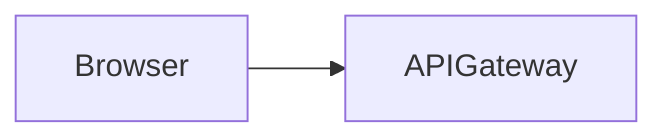

# excalidraw-mcp — Technical Specification

## Overview

excalidraw-mcp is a local system that lets Claude Desktop draw on an Excalidraw canvas in real time. It combines an MCP (Model Context Protocol) server, a file-watcher bridge, a React-based Excalidraw frontend, and a Kroki diagram-rendering service.

---

## System Components

### 1. MCP Server (`mcp-server/`)

**Runtime:** Node.js (host machine, stdio transport)  
**Language:** TypeScript  
**Package manager:** pnpm  
**Entry point:** `dist/index.js`

The MCP server is the Claude-facing interface. It exposes tools via the MCP protocol over stdio and translates them into HTTP calls against the bridge.

**Environment variables:**

| Variable | Default | Purpose |
|---|---|---|
| `BRIDGE_URL` | `http://localhost:3001` | Bridge HTTP API base URL |
| `KROKI_URL` | `http://localhost:8000` | Kroki rendering service URL |
| `VAULT_PATH` | — | Absolute path to `diagrams-vault/` on the host |

**Key modules:**

- `index.ts` — MCP server entry, tool definitions and dispatch
- `builder.ts` — `buildElements(specs)` → Excalidraw JSON element array + `idMap`
- `types.ts` — TypeScript interfaces for Excalidraw elements and `ElementSpec`

**Tool catalogue:**

_Scene tools_

| Tool | Params | Effect |
|---|---|---|
| `list_scenes` | — | Returns `string[]` of `.excalidraw` filenames |
| `create_scene` | `name`, `background?` | Creates empty scene file |
| `read_scene` | `name` | Returns full scene JSON |
| `add_elements` | `name`, `elements[]` | Appends elements via builder |
| `update_element` | `name`, `id`, `props` | Patches one element's properties |
| `delete_element` | `name`, `ids[]` | Removes elements by ID |
| `clear_scene` | `name` | Wipes all elements |
| `delete_scene` | `name` | Deletes the `.excalidraw` file |
| `get_scene_summary` | `name` | Returns element counts, types, bounding box |
| `add_diagram` | `name`, `nodes[]`, `edges[]` | Full diagram in one call (calls builder twice — see Known Quirks) |

_Diagram-as-code tools_

| Tool | Params | Effect |
|---|---|---|
| `create_diagram` | `path`, `format`, `source`, `scene`, ... | Writes `.md` to vault → Kroki → SVG image element → git push |
| `update_diagram` | `path`, `source` | Re-renders in-place → git push |
| `render_diagram` | `path`, `scene` | Re-renders an existing diagram into a scene |
| `get_diagram` | `path` | Returns source + frontmatter |
| `list_diagrams` | `folder?` | Lists `.md` files in vault |
| `git_log` | — | Vault commit history |
| `git_status` | — | Remote + branch info |

---

### 2. Bridge (`bridge/`)

**Runtime:** Node.js (Docker container)  
**Language:** TypeScript  
**Framework:** Fastify v4  
**Package manager:** pnpm  
**Port:** 3001 (mapped to host)

The bridge is the central hub between the MCP server and the browser. It owns the filesystem (scenes + vault), fires chokidar watchers, and pushes SSE events to connected browsers.

**Environment variables:**

| Variable | Default | Purpose |
|---|---|---|
| `PORT` | `3001` | Listen port |
| `SCENES_DIR` | `./scenes` | Mount point for `.excalidraw` files |
| `VAULT_DIR` | `./diagrams-vault` | Mount point for the Obsidian vault |

**HTTP API:**

| Method | Path | Body | Response |
|---|---|---|---|
| `GET` | `/health` | — | `{ status, scenes_dir, vault_dir }` |
| `GET` | `/events` | — | SSE stream (text/event-stream) |
| `GET` | `/scenes` | — | `string[]` |
| `GET` | `/scenes/:name` | — | Scene JSON |
| `PUT` | `/scenes/:name` | Scene JSON | `{ success, file }` |
| `DELETE` | `/scenes/:name` | — | `{ success }` |
| `POST` | `/scenes/:name/rename` | `{ newName }` | `{ success, file }` |
| `GET` | `/diagrams` | — | `string[]` (relative paths) |
| `GET` | `/diagrams/*` | — | `{ path, content }` |
| `PUT` | `/diagrams/*` | `{ content }` | `{ success, path }` |
| `DELETE` | `/diagrams/*` | — | `{ success }` |

**SSE events:**

| Event | Payload | Trigger |
|---|---|---|
| `connected` | `{ clientId }` | On initial connect |
| `scene_added` | `{ file }` | `.excalidraw` file created |
| `scene_changed` | `{ file }` | `.excalidraw` file modified |
| `scene_removed` | `{ file }` | `.excalidraw` file deleted |
| `diagram_added` | `{ path }` | `.md` file created in vault |
| `diagram_changed` | `{ path }` | `.md` file modified in vault |
| `diagram_removed` | `{ path }` | `.md` file deleted from vault |

Heartbeat comment frames (`: heartbeat`) sent every 25 s to prevent nginx/proxy timeouts.

**Security:**

- `sanitizeName()` — strips path traversal, enforces `.excalidraw` extension
- `sanitizeDiagramPath()` — rejects `..` segments, validates each segment against `[\w\-. ]+`

---

### 3. Excalidraw App (`excalidraw-app/`)

**Runtime:** nginx (Docker container)  
**Port:** 3000 (host) → 80 (container)  
**Stack:** React + Vite + `@excalidraw/excalidraw`

The frontend renders the Excalidraw canvas and connects to the bridge SSE stream for live updates.

**Key behaviours:**

- Scene selector dropdown: lists all `.excalidraw` files
- New / Save / Delete scene buttons
- Ctrl+S / Cmd+S: saves current scene to bridge
- SSE status dot: amber = connecting, green = live, red = reconnecting (auto-retries every 3 s)
- On `scene_changed` for the currently open scene: calls `excalidrawAPI.updateScene()` (no page reload)
- On `scene_changed` for other scenes: refreshes scene list only

**Nginx proxy:**

`/api` → `bridge:3001` (internal Docker network). This means the browser never directly touches port 3001 — all bridge calls are proxied.

---

### 4. Kroki + Mermaid (Docker services)

**Kroki:** `yuzutech/kroki`, port 8000  
**Mermaid companion:** `yuzutech/kroki-mermaid`, internal port 8002

Kroki converts diagram source text to SVG. Supported formats include: `mermaid`, `plantuml`, `graphviz`, `d2`, `c4plantuml`, `structurizr`, `bpmn`, `erd`, `nomnoml`, and ~20 more.

The MCP server calls Kroki directly (not through the bridge) via `KROKI_URL`. The resulting SVG is base64-encoded and stored as an `image` element in the Excalidraw `files{}` map — fully embedded in the `.excalidraw` file.

---

## Data Flows

### Scene live-reload

```
Claude → MCP tool → PUT /scenes/:name (bridge) → writes .excalidraw
  → chokidar detects change → broadcast SSE scene_changed
  → browser receives SSE → excalidrawAPI.updateScene()
```

### Diagram-as-code live-reload

```
Claude → MCP tool → PUT /diagrams/* (bridge) → writes .md to vault
  → chokidar detects change → broadcast SSE diagram_changed
  → MCP server (parallel) → POST Kroki → SVG
  → SVG base64 → PUT /scenes/:name (bridge) → writes image element
  → chokidar detects scene change → broadcast SSE scene_changed
  → browser receives SSE → excalidrawAPI.updateScene()
```

### Git auto-push

```
create_diagram / update_diagram → simple-git (host) → git add + commit + push
```

---

## Vault Format

Each diagram source is a Markdown file with YAML frontmatter:

```markdown
---
title: System Architecture
format: mermaid
scene: architecture.excalidraw
tags: [architecture, backend]
created: 2025-01-15
updated: 2025-01-15
---

# System Architecture

> One-line description


```

`format` must be a Kroki-supported type. The `scene` field tells the MCP server which `.excalidraw` file to place the rendered SVG into.

---

## Networking

```
Host machine:
  ├── MCP server (stdio, no port)
  ├── :3001  ← bridge (mapped from Docker)
  └── :8000  ← Kroki (mapped from Docker)

Docker network (excalidraw-net):
  ├── bridge:3001
  ├── excalidraw-app:80  (host :3000)
  ├── kroki:8000
  └── mermaid:8002
```

The excalidraw-app nginx proxies `/api/*` → `bridge:3001`, so the browser accesses scenes via `GET /api/scenes` which resolves inside Docker.

---

## `builder.ts` Internals

`buildElements(specs: ElementSpec[])` produces `{ elements, idMap }`:

- Each spec with a `text` field emits two elements: the shape + a bound `TextElement` (`containerId` set to the shape's ID)
- Linear elements (line/arrow): bounding box computed from `points`
- `startBindingId` / `endBindingId` → binding object `{ elementId, focus: 0, gap: 8 }`
- IDs: `randomBytes(8).toString("hex")`
- `seed` / `versionNonce`: `Math.floor(Math.random() * 2**31)`
- Default `fillStyle`: `hachure`; default `roughness`: `1`

**`ElementSpec` fields:**

`type`, `x`, `y`, `width`, `height`, `text`, `strokeColor`, `backgroundColor`, `fillStyle`, `strokeWidth`, `strokeStyle`, `roughness` (0=clean, 1=normal, 2=sketchy), `opacity`, `rounded`, `fontSize`, `fontFamily` (1=Virgil hand, 2=Helvetica, 3=Cascadia mono), `textAlign`, `points`, `startArrowhead`, `endArrowhead`, `startBindingId`, `endBindingId`

---

## Known Quirks

- **`add_diagram` double-build:** Calls `buildElements` twice — once for nodes, once with arrows appended. The `idMap` from the second call is discarded; arrow binding uses `nodeElementIds` from the first call.
- **Scene auto-reload scope:** The excalidraw-app only auto-reloads when the *currently selected* scene changes. Other scene changes only refresh the dropdown list.
- **Vault is a separate git repo:** `diagrams-vault/` is not a subfolder of `excalidraw-mcp/`. It's a separate repository mounted into Docker as a volume. `git` operations run from the MCP server on the host via `simple-git`.
- **SVG storage:** Kroki-rendered SVGs are stored as base64 `image` elements in the Excalidraw `files{}` map, not as external URLs. They are fully self-contained in the `.excalidraw` file.

---

## Dev Commands

```bash
# Start all Docker services (bridge, excalidraw-app, kroki, mermaid)
docker compose up --build -d
docker compose logs -f bridge

# MCP server (host machine)
cd mcp-server
pnpm install
pnpm run build          # tsc → dist/
pnpm run dev            # tsx watch mode (no build needed)

# Bridge (host machine, for development without Docker)
cd bridge
pnpm install
pnpm run dev            # tsx src/index.ts

# First-time vault setup
bash setup-vault.sh
```

---

## Claude Desktop Configuration

```json
{
  "mcpServers": {
    "excalidraw": {
      "command": "node",
      "args": ["D:/developments/excalidraw-mcp/mcp-server/dist/index.js"],
      "env": {
        "BRIDGE_URL": "http://localhost:3001",
        "KROKI_URL": "http://localhost:8000",
        "VAULT_PATH": "D:/developments/excalidraw-mcp/diagrams-vault"
      }
    }
  }
}
```

After editing the config, restart Claude Desktop for the new tools to appear.
