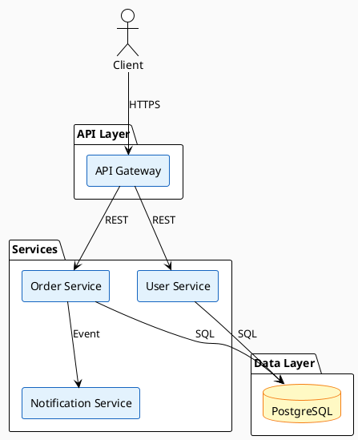

# Microservices Architecture

> Component diagram: API Gateway, User/Order/Notification services, PostgreSQL

```plantuml
@startuml
!theme plain
skinparam componentStyle rectangle
skinparam backgroundColor #FAFAFA
skinparam component {
  BackgroundColor #E3F2FD
  BorderColor #1565C0
  FontSize 14
}
skinparam database {
  BackgroundColor #FFF9C4
  BorderColor #F57F17
}

actor Client

package "API Layer" {
  [API Gateway] as GW
}

package "Services" {
  [User Service] as US
  [Order Service] as OS
  [Notification Service] as NS
}

package "Data Layer" {
  database "PostgreSQL" as PG
}

Client --> GW : HTTPS
GW --> US : REST
GW --> OS : REST
OS --> NS : Event
US --> PG : SQL
OS --> PG : SQL

@enduml
```
