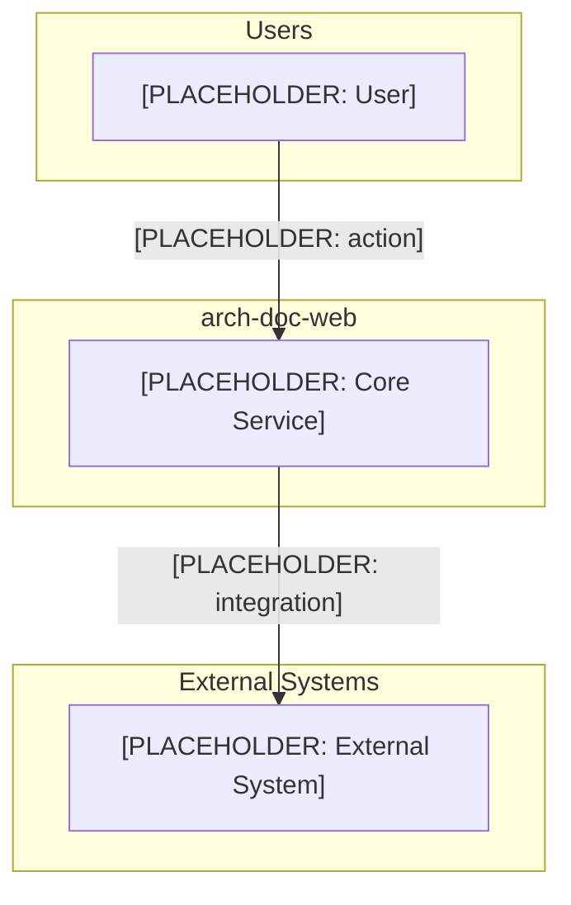

# arch-doc-web — Solution Architecture Document

## 1. Executive Summary

[PLACEHOLDER: 2–3 sentences describing what this system does and why it exists.]

## 2. Business Context

### 2.1 Business Goals

- [PLACEHOLDER: Goal 1]
- [PLACEHOLDER: Goal 2]
- [PLACEHOLDER: Goal 3]

### 2.2 Stakeholders

| Stakeholder | Role | Interest |
|---|---|---|
| [PLACEHOLDER] | [PLACEHOLDER] | [PLACEHOLDER] |

## 3. System Overview

### 3.1 Scope

[PLACEHOLDER: Define what is in scope and what is explicitly out of scope.]

### 3.2 System Context

## 4. Architecture Decisions

### 4.1 Key Decisions

| Decision | Rationale | Alternatives Considered |
|---|---|---|
| [PLACEHOLDER] | [PLACEHOLDER] | [PLACEHOLDER] |

## 5. Architecture Views

### 5.1 Logical Architecture

[PLACEHOLDER: Describe the major logical layers or domains.]

### 5.2 Physical Architecture

[PLACEHOLDER: Describe deployment topology — cloud, on-prem, containers, etc.]

## 6. Quality Attributes

| Attribute | Requirement | Mechanism |
|---|---|---|
| Availability | [PLACEHOLDER] | [PLACEHOLDER] |
| Performance | [PLACEHOLDER] | [PLACEHOLDER] |
| Security | [PLACEHOLDER] | [PLACEHOLDER] |
| Scalability | [PLACEHOLDER] | [PLACEHOLDER] |

## 7. Technology Stack

| Layer | Technology | Version | Rationale |
|---|---|---|---|
| [PLACEHOLDER] | [PLACEHOLDER] | [PLACEHOLDER] | [PLACEHOLDER] |

## 8. Cross-Cutting Concerns

### 8.1 Security

[PLACEHOLDER: Authentication, authorisation, secrets management.]

### 8.2 Observability

[PLACEHOLDER: Logging, metrics, tracing approach.]

### 8.3 Disaster Recovery

- RTO: [PLACEHOLDER]
- RPO: [PLACEHOLDER]

## 9. Risks and Mitigations

| Risk | Likelihood | Impact | Mitigation |
|---|---|---|---|
| [PLACEHOLDER] | Low/Med/High | Low/Med/High | [PLACEHOLDER] |

## 10. Open Questions

- [ ] [PLACEHOLDER: Question 1]
- [ ] [PLACEHOLDER: Question 2]
