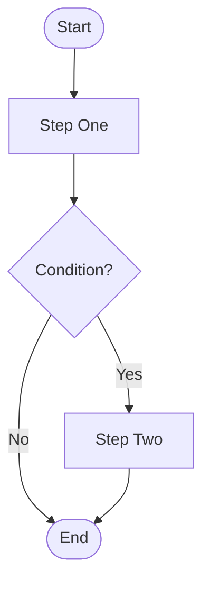
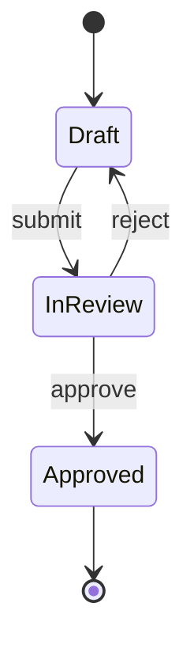

# Flows

This folder holds user flows, business process flows, and state machine diagrams.

## Document Types

| Type | Format | Purpose |
|---|---|---|
| User Flow | mermaid flowchart | Step-by-step user journey |
| Business Process | mermaid flowchart | Cross-system process flow |
| State Machine | mermaid stateDiagram | Entity lifecycle / state transitions |

## Mermaid Examples

**Flowchart:**

**State Diagram:**

