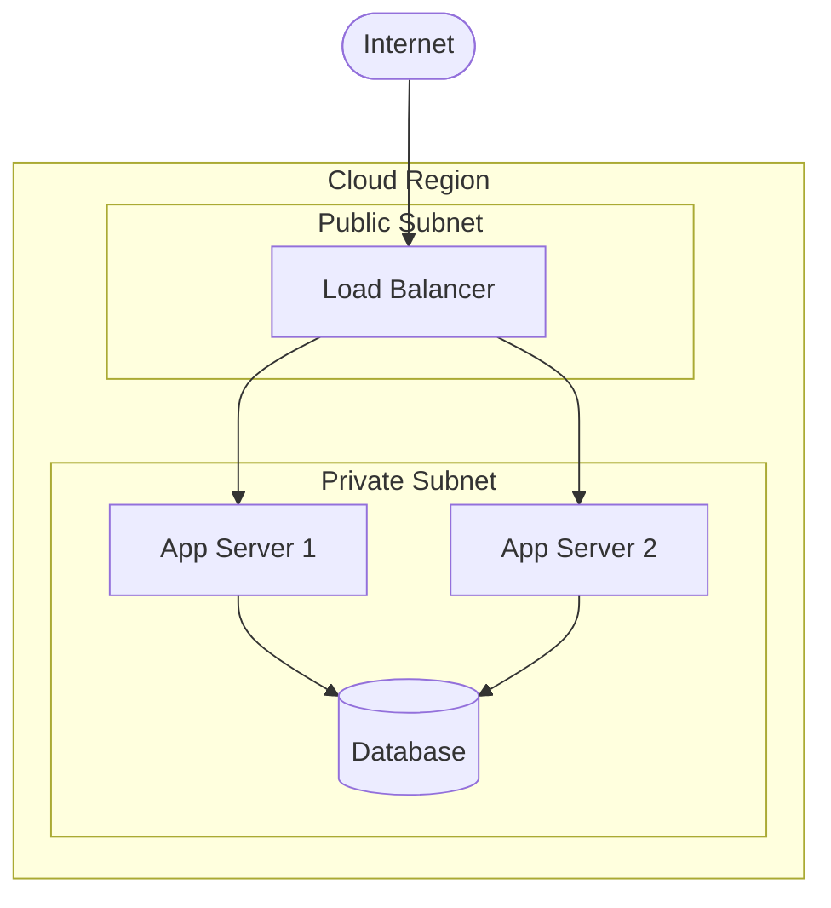

# Infrastructure

This folder holds deployment, cloud, networking, and disaster-recovery documentation.

## Document Types

| Type | Format | Purpose |
|---|---|---|
| Deployment Topology | mermaid graph | Physical / cloud deployment layout |
| Network Diagram | mermaid graph | VPCs, subnets, security groups |
| DR Plan | markdown | Recovery objectives and runbook links |
| CI/CD Pipeline | mermaid flowchart | Build → test → deploy pipeline |

## Mermaid Example

