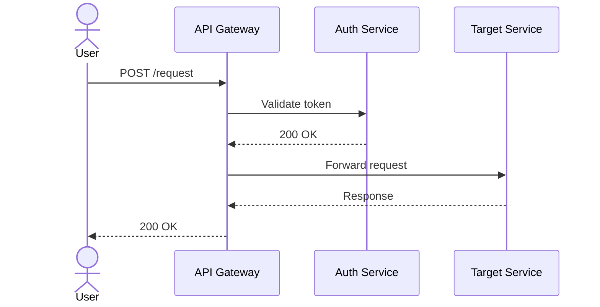

# Sequences

This folder holds sequence and interaction diagrams showing how components communicate over time.

## Document Types

| Type | Format | Purpose |
|---|---|---|
| API Call Flow | mermaid sequenceDiagram | REST / gRPC interaction between services |
| Auth Flow | mermaid sequenceDiagram | Login, token refresh, OAuth handshake |
| Event Flow | mermaid sequenceDiagram | Async message / event-driven interactions |

## Mermaid Example

