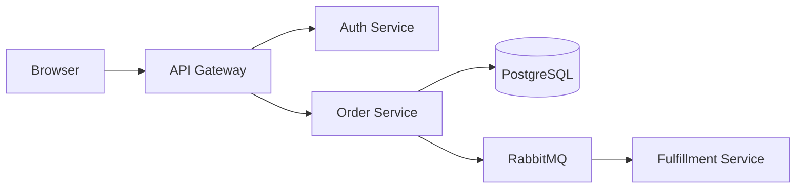

# System Overview

> High-level component view

```mermaid
graph LR
  Browser["Browser"] --> Gateway["API Gateway"]
  Gateway --> Auth["Auth Service"]
  Gateway --> Orders["Order Service"]
  Orders --> DB[("PostgreSQL")]
  Orders --> Queue["RabbitMQ"]
  Queue --> Fulfillment["Fulfillment Service"]
```
