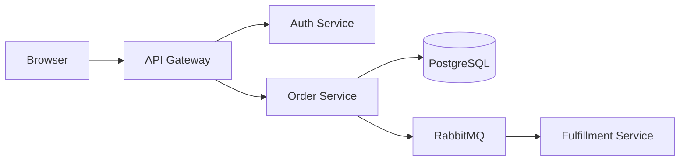

# Order Management System — Architecture Overview

This document describes the architecture of the Order Management System (OMS),
covering components, key interactions, and deployment topology.

## System Components

The OMS is composed of five services coordinated through an API Gateway.

| Service           | Responsibility                      |
|---|---|
| API Gateway       | Request routing, auth validation    |
| Auth Service      | JWT issuance and verification       |
| Order Service     | Order lifecycle management          |
| Payment Service   | Stripe integration                  |
| Fulfillment       | Warehouse picking and shipping      |

## Order Placement Flow

End-to-end sequence from customer request to fulfillment scheduling.

![[Sequences/Assets/order-placement.svg]]

## Checkout Flow

Customer-facing checkout process including payment and error handling.

![[Flows/Assets/checkout-flow.png]]

## Design Decisions

- **Async fulfillment** via RabbitMQ decouples order confirmation from warehouse operations.
- **PostgreSQL** is the single source of truth for order state.
- **JWT tokens** expire after 1 hour; refresh tokens have a 30-day rolling window.
- All error responses follow RFC 9457 Problem Details format.
