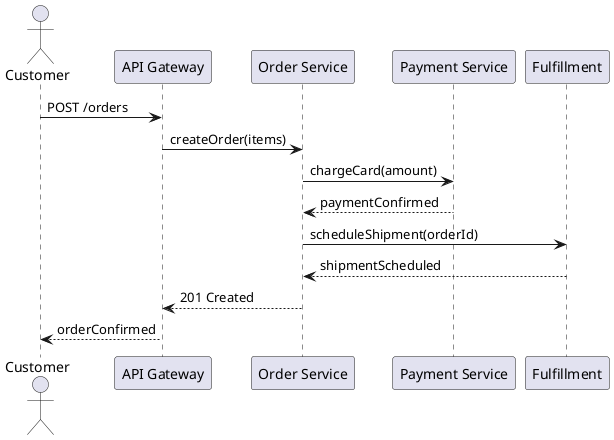

# Order Placement Sequence

![[Sequences/Assets/order-placement.svg]]

```plantuml
@startuml
actor Customer
participant "API Gateway" as GW
participant "Order Service" as OS
participant "Payment Service" as PS
participant "Fulfillment" as FS

Customer -> GW: POST /orders
GW -> OS: createOrder(items)
OS -> PS: chargeCard(amount)
PS --> OS: paymentConfirmed
OS -> FS: scheduleShipment(orderId)
FS --> OS: shipmentScheduled
OS --> GW: 201 Created
GW --> Customer: orderConfirmed
@enduml
```
