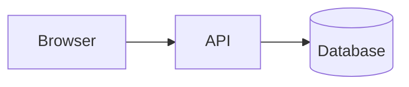

# ADR-001: Use Mermaid DSL for All Architecture Diagrams

## Status
**Accepted** — 2026-05-16

## Context

The architecture documentation system needs a standard format for diagrams embedded in Obsidian Markdown files. Diagrams must be:
- Human-readable and git-diffable
- Renderable in both Obsidian and VitePress
- Generatable by Claude AI without external tools
- Not stored as binary images

### Forces
- Obsidian natively renders Mermaid code blocks
- VitePress has a first-class Mermaid plugin (`vitepress-plugin-mermaid`)
- Claude AI can reliably generate Mermaid DSL from natural language descriptions
- Binary image files (PNG/SVG) are not meaningful in git diffs

## Decision

All architecture diagrams will be stored as Mermaid DSL in fenced code blocks within Markdown files:

````markdown

````

Kroki is used as the rendering backend for diagram preview during editing. When Kroki is unavailable, the public `https://kroki.io` endpoint serves as fallback.

## Consequences

### Positive
- Diagrams are fully version-controlled and meaningful in git diffs
- No binary file bloat in the repository
- Claude can generate, review, and update diagrams through MCP tools
- Obsidian renders diagrams natively without plugins
- VitePress renders diagrams on the published site

### Negative
- Mermaid has limited layout control compared to GUI tools like Excalidraw or Lucidchart
- Complex C4 diagrams require C4PlantUML syntax (rendered via Kroki, not native Obsidian)
- Mermaid syntax errors are only caught at render time

### Risks
- Mermaid syntax evolves; pinning the renderer version reduces risk

## Alternatives Considered

### Option 1: Excalidraw (.excalidraw JSON files)
**Pros**: Rich visual editing, collaborative, expressive
**Cons**: Binary-ish JSON not meaningful in diffs; requires Excalidraw plugin in Obsidian; no VitePress support

### Option 2: PlantUML (via Kroki)
**Pros**: Powerful, supports C4, sequence, state, component diagrams
**Cons**: Not natively supported in Obsidian without plugin; verbose syntax; harder for Claude to generate reliably

## Implementation Notes
- Use `@defensestation/blocknote-mermaid` in the web editor for inline diagram editing
- C4 diagrams (system context, container, component) use Mermaid's C4 support where possible, PlantUML via Kroki for advanced cases
- The `render_and_embed_diagram` MCP tool handles DSL → Kroki URL + .md embedding automatically

## Review Date
2026-11-16
