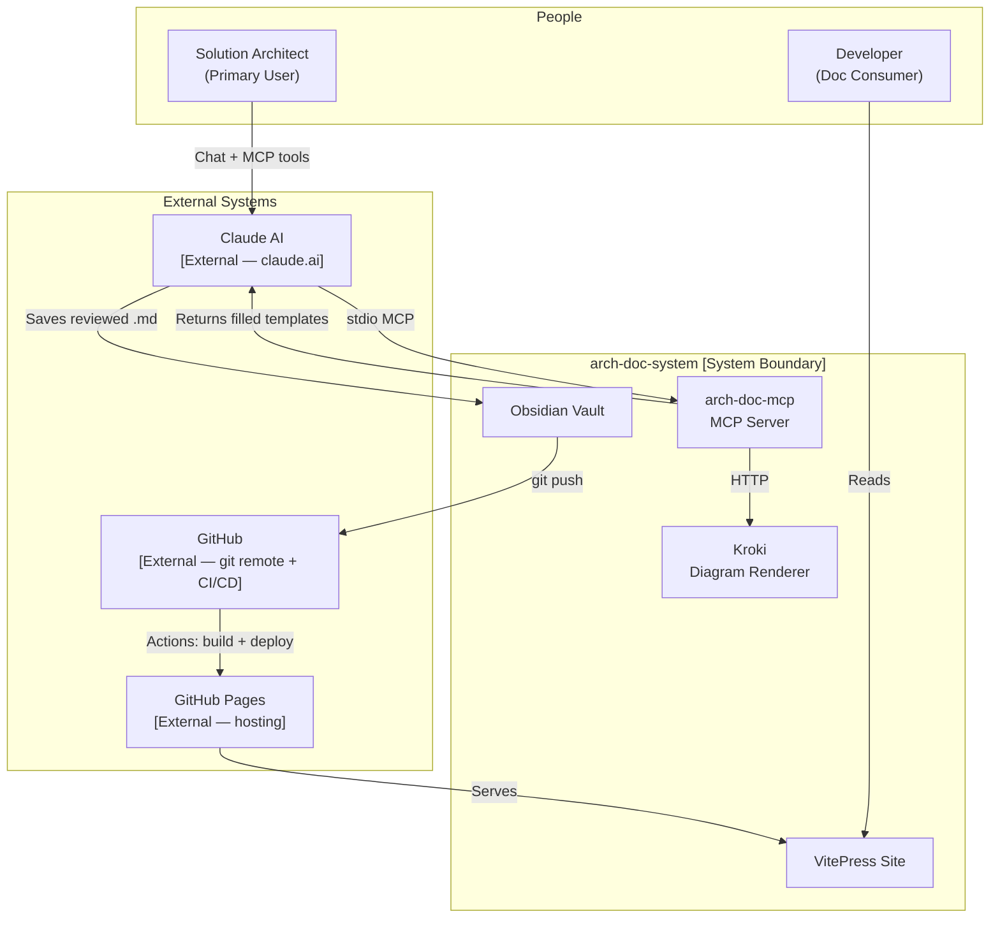

# arch-doc-system — System Context

> C4 Level 1: shows the arch-doc-system and its relationship to users and external systems.

## Actors

| Actor | Type | Description |
|---|---|---|
| Solution Architect | Human | Creates and reviews architecture documents using Claude |
| Developer | External User | Reads published documentation on the VitePress site |

## External Systems

| System | Owner | Integration | Data Exchanged |
|---|---|---|---|
| Claude AI (claude.ai) | Anthropic | MCP protocol (stdio) | Tool calls, template content |
| GitHub | GitHub Inc. | Git remote + GitHub Actions | Markdown files, build artifacts |
| GitHub Pages | GitHub Inc. | Static site hosting | HTML/CSS/JS site |

## Key Decisions
- The MCP server runs as a local process — no cloud deployment needed for the AI layer
- Kroki runs in Docker — fully self-hosted, no external API calls for diagram rendering
- The vault is a git repository — every document change is versioned and auditable
