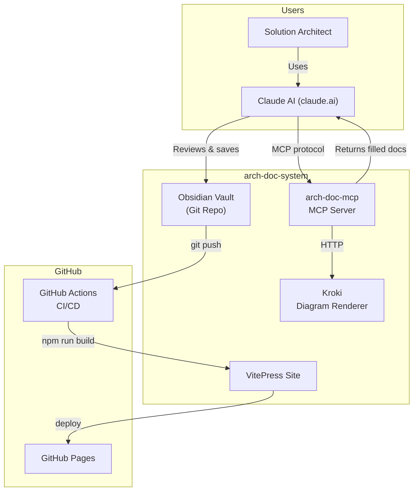

# arch-doc-system — Solution Architecture Document

## 1. Executive Summary

The arch-doc-system is a self-hosted AI-powered architecture documentation pipeline that enables solution architects to generate, review, and publish high-quality architecture documents using Claude AI and Kroki diagram rendering.

## 2. Business Context

### 2.1 Business Goals
- Reduce time-to-first-draft for SA documents from days to minutes
- Ensure consistent, structured documentation across all projects
- Enable diagram-as-code workflow (no binary image files in git)
- Publish living documentation as a static site automatically

### 2.2 Stakeholders

| Stakeholder | Role | Interest |
|---|---|---|
| Solution Architects | Primary users | Generate and review architecture docs |
| Engineering Teams | Consumers | Read and implement documented patterns |
| Engineering Manager | Sponsor | Documentation quality and velocity |

## 3. System Overview

### 3.1 Scope

The system covers the complete documentation lifecycle: AI-assisted generation via MCP tools, human review and verification in Obsidian, and automated publishing to a VitePress static site via GitHub Actions.

### 3.2 System Context

## 4. Architecture Decisions

### 4.1 Key Decisions

| Decision | Rationale | Alternatives Considered |
|---|---|---|
| Mermaid DSL in .md files | Obsidian-native, git-diffable, no binary assets | Embedded SVG, Excalidraw files |
| MCP server (stdio) | Works with Claude Desktop and Claude Code CLI | REST API, GraphQL |
| Self-hosted Kroki | No external API calls, supports 20+ diagram formats | kroki.io public, Mermaid CLI |
| VitePress for site | Markdown-native, fast build, Mermaid plugin available | Docusaurus, MkDocs |

## 5. Architecture Views

### 5.1 Logical Architecture

The system separates concerns into four layers:
1. **AI Generation Layer** — Claude + arch-doc-mcp: generates templates and diagrams
2. **Rendering Layer** — Kroki: converts DSL to SVG for preview
3. **Storage Layer** — Obsidian Vault: human-verified Markdown files in git
4. **Publication Layer** — VitePress + GitHub Actions: static site from vault

### 5.2 Physical Architecture

All components run on a developer workstation or CI server. Kroki runs in Docker. The MCP server runs as a Node.js process invoked by Claude Code CLI.

## 6. Quality Attributes

| Attribute | Requirement | Mechanism |
|---|---|---|
| Availability | N/A (developer tool) | Local Docker stack |
| Performance | < 2s diagram render | Kroki local Docker |
| Security | No secrets in git | .env files, .gitignore |
| Scalability | Single-developer primary use | Stateless MCP server |

## 7. Technology Stack

| Layer | Technology | Version | Rationale |
|---|---|---|---|
| MCP Server | Node.js + TypeScript | 20 / 5.5 | MCP SDK is Node-first |
| Diagram Rendering | Kroki (Docker) | latest | 20+ format support |
| Documentation Storage | Obsidian Vault (Markdown) | any | Human-friendly editing |
| Static Site | VitePress | 1.3+ | Fast, Mermaid plugin |
| CI/CD | GitHub Actions | N/A | Free for public repos |

## 8. Cross-Cutting Concerns

### 8.1 Security
No user data is processed. All content stays local until git push. Secrets (API keys) are in `.env` and gitignored.

### 8.2 Observability
MCP server logs to stderr. Kroki container exposes `/health`. GitHub Actions provides build logs.

### 8.3 Disaster Recovery
- RTO: Minutes (re-clone repo + `docker compose up`)
- RPO: Last git commit

## 9. Risks and Mitigations

| Risk | Likelihood | Impact | Mitigation |
|---|---|---|---|
| Kroki container unavailable | Low | Medium | Fallback to kroki.io public URL |
| Claude generates incorrect DSL | Medium | Low | Human review before commit |
| VitePress Mermaid plugin breaks | Low | Medium | Pin plugin version |

## 10. Open Questions
- [ ] Support multi-user collaboration (shared vault via git remote)?
- [ ] Add AI-powered document review / quality scoring?
